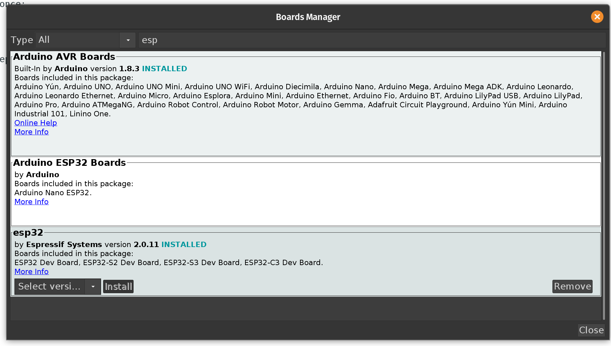
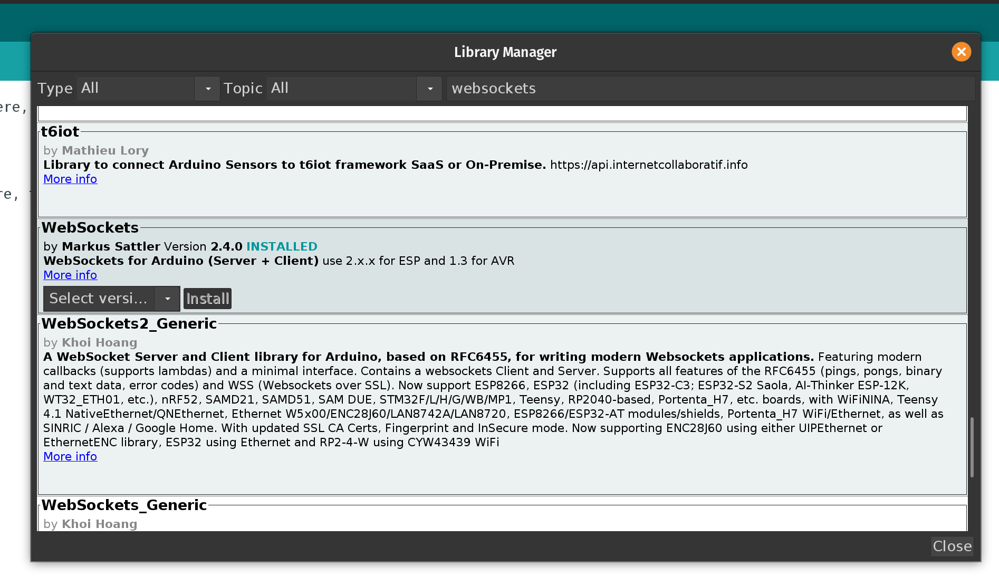
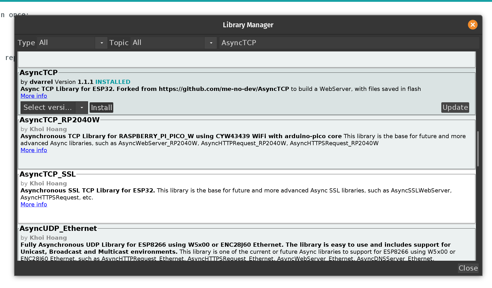
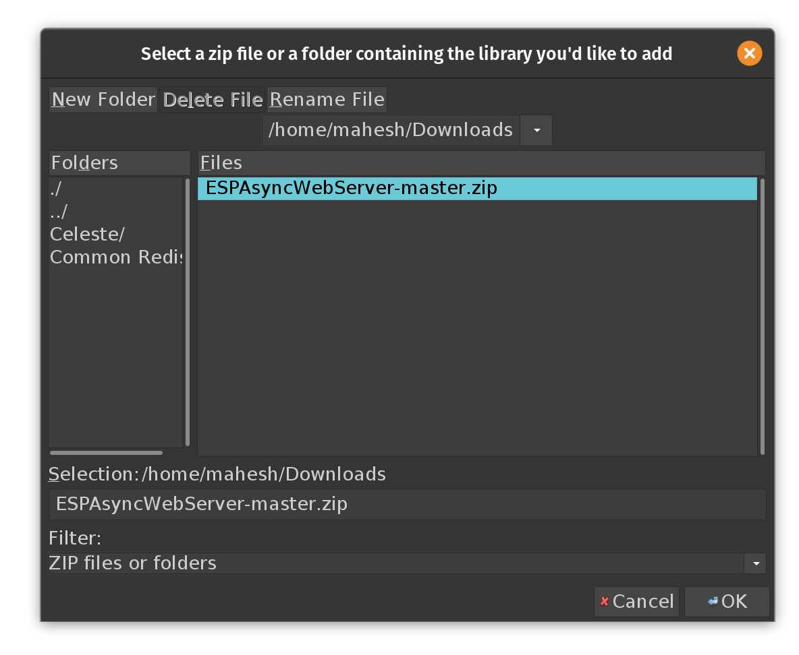

# BioSignal-Recorder

A utility for visualizing and recording Biopotential Signals using Upside Down Labs BioAmp.

## Demonstration

<p align = "center">
    
    
</p>

## Requirements

### Hardware

1. [ESP32 Devkitc V1](https://www.espressif.com/en/products/devkits/esp32-devkitc)
2. [Upside Down Labs BioAmp](https://store.upsidedownlabs.tech/product/bioamp-exg-pill/)

### Software

1. [Arduino IDE](https://www.arduino.cc/en/software)
2. [Arduino-ESP32 Core](https://github.com/espressif/arduino-esp32)
3. [AsyncTCP library](https://www.arduino.cc/reference/en/libraries/asynctcp/)
4. [ESPAsyncWebServer library](https://github.com/me-no-dev/ESPAsyncWebServer)
5. [WebsocketsServer Library](https://www.arduino.cc/reference/en/libraries/websockets/)
6. [ESP32 Filesystem Uploader in Arduino](https://github.com/me-no-dev/arduino-esp32fs-plugin)

## Installations

1. Download and install Arduino IDE. Make sure to install legacy version 1.8.x and not v2.
2. Let's first install Arduino-ESP32 core by going to ``` Tools -> Board -> Board manager ```. Find and install ESP32.
    <p align = "center">
        
    </p>
3. Now open arduino IDE, go to ```Sketch -> Include Library -> Manage Libraries```. Serach for Websockets and install.
    <p align = "center">
        
    </p>
4. Follow same step for AsyncTCP library.
    <p align = "center">
        
    </p>
5. Now to install ESPAsyncWebserver, first download the zip file from [here](https://github.com/me-no-dev/ESPAsyncWebServer/archive/master.zip). Then go to ``` Sketch ->Include Library -> Add .ZIP Library```. Then go to downloads and select downloaded zip file.
    <p align = "center">
        
    </p>
6. Now to install ESP32FS plugin, download this [.zip](https://github.com/me-no-dev/arduino-esp32fs-plugin/releases/download/1.1/ESP32FS-1.1.zip) file. Extract this file and place it in ```<home_dir>/Arduino/tools/ESP32FS/tool/esp32fs.jar```. You will have to create a ``` tools ``` directory inside your ```<home_dir>/Arduino``` directory if not present already.
Fot all changes to take place, reload Arduino IDE.
## Connections
<p align = "center">
    
</p>


## Setup Instructions

1. Open BioSignal-Recorder.ino with Arduino IDE.
2. In your Arduino IDE under ``` Tools -> Board``` make sure you choose "ESP32 Dev Module" or a board allowing partition schemes.
3. Under ``` Tools -> Upload Speeds ``` Choose ```115200```.
4. Under ``` Tools -> Partition Scheme``` Choose ``` Default 4mb with SPIFFS```.
5. Find and change SSID to your WiFi SSID and PASSWORD to your WiFi password.
6. Compile sketch and upload it on your ESP32.
7. In your Arduino IDE click on ``` Tools-> ESP32 Sketch Data Upload```. BioSignal-Recorder uses spiffs file system.
8. If SPIFFS upload fails, then try installing this [alternative](https://github.com/lorol/arduino-esp32fs-plugin/releases/download/2.0.7/esp32fs.zip) for ESP32FS Plugin. Make sure to remove older .jar file and follow same installation instruction.
8. Go to the serial monitor, you can find IP for the webpage, you might have to hard reset your esp32 at this stage if the IP is not displayed.
9. Use any browser to access given IP address. Make sure the device is connected to the same SSID as added in .ino file.
10. Select GPIO number and frequency and start visualising.
## Features

|Feature | Discription|
|--------|------------|
|Multichannel       |    ESP32 has 4 hardware timers which are currently being used for sampling data according to provided sampling rate. User can choose number of channels to use.|
|Variable sampling rate | Multiple options for sampling rate are given from 100Hz to 5000Hz.Every channel can be set with different sampling rate.|
|Save as CSV | Data can be saved as a CSV file and downloaded on computer. CSV file contains data with timestamp, channel number and packet number of corresponding channel.|

Note: ESP32 has 2 ADC units. ADC1 and ADC2. ADC2 is shared with WIFI module hence we can only use pins in ADC1 channel. ADC1 has 8 pins, GPIO 32-39.

## Resources

The frontend of this project inspired from [BojunJurca's Esp32_oscilloscope](https://github.com/BojanJurca/Esp32_oscilloscope) project.
