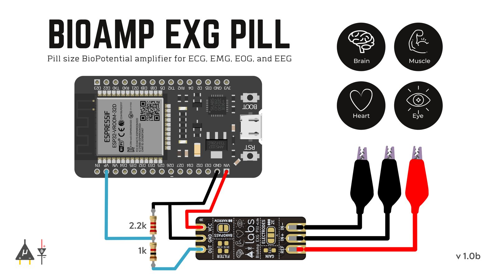

# BioSignal-Recorder

A utility for visualizing and recording Biopotential Signals using Upside Down Labs BioAmp.

## Demonstration

## Prerequisites

1. [ESP32 Devkitc V1](https://www.espressif.com/en/products/devkits/esp32-devkitc)
2. [Arduino IDE](https://support.arduino.cc/hc/en-us/articles/360019833020-Download-and-install-Arduino-IDE)
3. [ESP32 Filesystem Uploader in Arduino](https://randomnerdtutorials.com/install-esp32-filesystem-uploader-arduino-ide/)
4. [Upside Down Labs BioAmp](https://store.upsidedownlabs.tech/shop/)

## Connections

## Setup Instructions

1. Open BioSignal-Recorder.ino with Arduino IDE.
2. Find and change SSID to your WiFi SSID and PASSWORD to your WiFi password.
3. In your Arduino IDE under Tools|Board make sure you choose "ESP32 Dev Module" or a board allowing partition schemes.
4. Compile sketch and run it on your ESP32.
5. In your Arduino IDE under Tools, click ESP32 Sketch Data Upload, BioSignal-Recorder uses spiffs file system.
6. Go to the serial monitor, you can find IP for the webpage, you might have to hard reset your esp32 at this stage if the IP is not displayed.

## Features

|Feature | Discription|
|--------|------------|
|Multichannel       |    ESP32 has 4 hardware timers which are currently being used for sampling data according to provided sampling rate. User can choose number of channels to use.|
|Variable sampling rate | Multiple options for sampling rate are given from 100Hz to 5000Hz.Every channel can be set with different sampling rate.|
|Save as CSV | Data can be saved as a CSV file and downloaded on computer. CSV file contains data with timestamp, channel number and packet number of corresponding channel.|

Note: ESP32 has 2 ADC units. ADC1 and ADC2. ADC2 is shared with WIFI module hence we can only use pins in ADC1 channel. ADC1 has 8 pins, GPIO 32-39.

## Resources

The frontend of this project inspired from [BojunJurca's Esp32_oscilloscope](https://github.com/BojanJurca/Esp32_oscilloscope) project.
